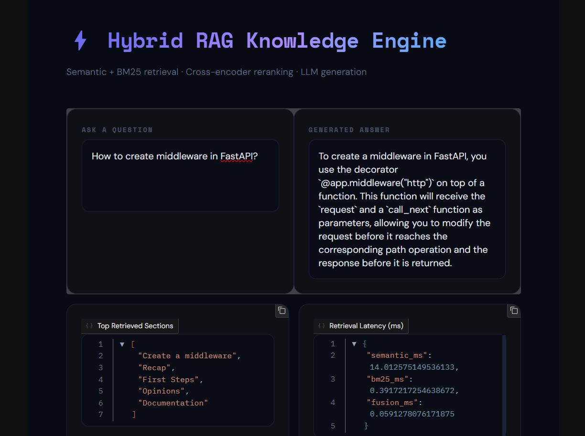
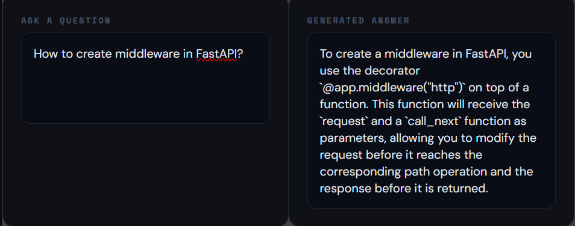
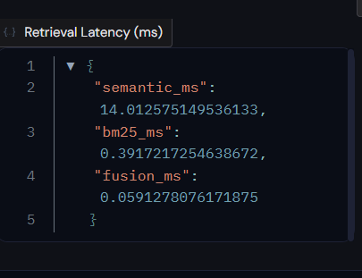
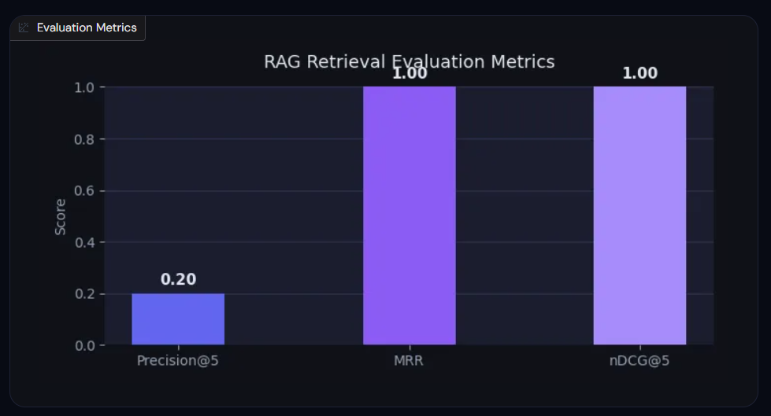

⚡ Hybrid RAG Knowledge Engine

  
  
  
  
  
  

A production-style Retrieval Augmented Generation (RAG) system that answers questions about FastAPI documentation using hybrid retrieval, reranking, and LLM generation.

The system combines semantic search (FAISS) and keyword search (BM25), followed by cross-encoder reranking, to retrieve the most relevant documentation context before generating an answer with an LLM.

The project also includes retrieval evaluation metrics and visualization to measure the quality of the RAG pipeline.

🚀 Features
🔎 Hybrid Retrieval

Semantic search using SentenceTransformers embeddings + FAISS

Keyword search using BM25

Hybrid score fusion for improved recall

🧠 Reranking

Cross-encoder reranker (ms-marco-MiniLM-L-6-v2)

Improves relevance of top retrieved chunks

🤖 LLM Generation

Groq LLM used for context-aware answer generation

Answers generated strictly from retrieved documentation

📊 Retrieval Evaluation

Includes standard IR metrics:

Precision@K

MRR (Mean Reciprocal Rank)

nDCG@K

Metrics are visualized using Matplotlib charts.

⚡ Observability

Retrieval latency breakdown:

Semantic search time

BM25 search time

Hybrid fusion time

🎨 Interactive UI

Built using Gradio

UI shows:

Generated answer

Retrieved document sections

Retrieval latency

Evaluation metrics chart

🧠 System Architecture
FastAPI Documentation
        │
        ▼
Document Ingestion
        │
        ▼
Markdown Section Parsing
        │
        ▼
Document Chunking
        │
        ▼
Embedding Generation (MiniLM)
        │
        ▼
Vector Index (FAISS)
        │
        ▼
BM25 Keyword Index
        │
        ▼
Hybrid Retrieval (Semantic + Keyword)
        │
        ▼
Cross Encoder Reranking
        │
        ▼
Top Relevant Context
        │
        ▼
Groq LLM Generation
        │
        ▼
Final Answer
🧩 Project Structure
rag_knowledge_engine/
│
├── app/
│   ├── ui.py                # Gradio interface
│   ├── ingestion.py        # Documentation ingestion
│   ├── chunker.py          # Intelligent document chunking
│   ├── embeddings.py       # Embedding + FAISS indexing
│   ├── bm25_retriever.py   # BM25 keyword retrieval
│   ├── hybrid_search.py    # Hybrid retrieval logic
│   ├── reranker.py         # Cross-encoder reranking
│   ├── generator.py        # Groq LLM generation
│   ├── evaluator.py        # Retrieval metrics
│   ├── eval_dataset.py     # Evaluation queries dataset
│
├── data_fastapi_docs/      # FastAPI documentation data
├── tests/
├── requirements.txt
└── README.md
⚙️ Installation

Clone the repository:

git clone https://github.com/patelpattu90-ai/hybrid-rag-knowledge-engine.git
cd hybrid-rag-knowledge-engine

Create a virtual environment:

python -m venv venv
source venv/bin/activate

Install dependencies:

pip install -r requirements.txt
🔑 Environment Setup

Add your Groq API key:

export GROQ_API_KEY=your_api_key_here

Or create a .env file:

GROQ_API_KEY=your_api_key_here
▶️ Run the Application

Start the RAG system:

python -m app.ui

Open the UI:

http://127.0.0.1:7860
💬 Example Queries

Try asking:

How does dependency injection work in FastAPI?
Why is FastAPI fast?
How to create middleware in FastAPI?
How do path parameters work in FastAPI?
📊 Example Output

The system returns:

Generated Answer

To create middleware in FastAPI, you use the decorator
@app.middleware("http") on top of a function...

Retrieved Sections

Create a middleware
Recap
First Steps
Opinions
Documentation

Latency Metrics

semantic_ms: 14.01
bm25_ms: 0.39
fusion_ms: 0.05

Evaluation Metrics

Precision@5
MRR
nDCG@5
📈 Evaluation Metrics
Metric	Description
Precision@K	Percentage of relevant documents in top K results
MRR	Measures ranking position of first relevant document
nDCG@K	Ranking quality considering position importance

These metrics help evaluate retrieval performance in the RAG pipeline.

🛠 Tech Stack
Component	Technology
Embeddings	SentenceTransformers
Vector Search	FAISS
Keyword Search	BM25
Reranking	Cross-Encoder
LLM	Groq
UI	Gradio
Visualization	Matplotlib
Language	Python

## 🎯 Why This Project

Most RAG systems rely on pure semantic search — which fails on exact keyword lookups.
This project solves that by combining semantic + keyword retrieval with cross-encoder
reranking, giving significantly better retrieval quality than single-method approaches.

Built to demonstrate production-ready RAG architecture with real evaluation metrics,
not just a demo that "works on my machine".

<h2 align="center">📸 Project Demo</h2>

  

<b>Upload documentation and ask questions</b>

 

  

<b>Hybrid RAG retrieving semantic + keyword results</b>

 

  

<b>Latency comparison between retrieval methods</b>

 

  

<b>Evaluation metrics of retrieval quality</b>
