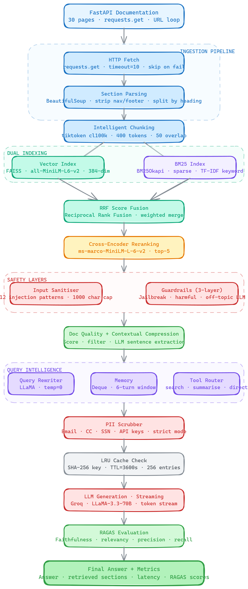

# ⚡ Hybrid RAG Knowledge Engine

> A production-grade Retrieval-Augmented Generation system built on FastAPI documentation.
> Every layer of the pipeline is observable, evaluated, and security-hardened.


---

## 🗂️ Table of Contents

- [What This Is](#what-this-is)
- [Architecture](#architecture)
- [Pipeline Walkthrough](#pipeline-walkthrough)
- [Features](#features)
- [Project Structure](#project-structure)
- [Setup](#setup)
- [Usage](#usage)
- [Evaluation Metrics](#evaluation-metrics)
- [Day-by-Day Build Log](#day-by-day-build-log)

---

## What This Is

A full-stack RAG system that retrieves answers from FastAPI documentation using:

- **Hybrid search** — semantic (FAISS + MiniLM embeddings) + keyword (BM25) with RRF score fusion
- **Cross-encoder reranking** — ms-marco reranks top results for precision
- **LLM generation** — LLaMA 3.3 70B via Groq API with streaming
- **9 production layers** — caching, query rewriting, conversation memory, tool routing, guardrails, security, RAGAS evaluation, doc quality scoring, and contextual compression

Every query goes through all 9 layers in under 3 seconds (excluding RAGAS evaluation).

---

## Architecture



## Pipeline Walkthrough

| Step | Module | What happens |
|------|--------|-------------|
| 0a | `security.py` | Injection patterns stripped, query truncated to 1000 chars |
| 0b | `guardrails.py` | 3-layer check: jailbreak → harmful → off-topic LLM |
| 1 | `cache.py` | SHA-256 lookup — return cached result if hit |
| 2 | `query_rewriter.py` | LLM rewrites query for better retrieval |
| 3 | `tool_router.py` | Routes to search_docs / summarise / answer_direct |
| 4 | `hybrid_search.py` + `reranker.py` | FAISS + BM25 → RRF fusion → cross-encoder rerank |
| 4b | `doc_quality.py` + `compressor.py` | Score chunks → filter low quality → compress to relevant sentences |
| 5–6 | `memory.py` + `generator.py` | Inject history + stream answer tokens |
| 7 | `security.py` (PIIScrubber) | Scrub PII from generated answer |
| 8 | `ragas_eval.py` | 4-metric evaluation after full answer generated |

---

## Features

### 🔍 Retrieval
- **Hybrid search** combining dense (FAISS, 384-dim) and sparse (BM25) retrieval
- **RRF fusion** — Reciprocal Rank Fusion combines both result lists
- **Cross-encoder reranking** — ms-marco-MiniLM-L-6-v2 rescores top results
- **Contextual compression** — LLM extracts only relevant sentences per chunk

### 🧠 Generation
- **LLaMA 3.3 70B** via Groq API — fastest inference available
- **Token streaming** — answer appears word by word in the UI
- **Conversation memory** — sliding window of 6 turns, per-session isolated
- **Tool routing** — 3 modes: factual retrieval, structured summary, direct answer

### 🛡️ Safety
- **Prompt injection defense** — 12 regex patterns + length cap
- **Guardrails** — jailbreak, harmful content, off-topic (3 layers)
- **PII scrubbing** — two-tier: conservative for chunks, strict for answers

### 📊 Evaluation
- **Retrieval metrics** — Precision@5, MRR, nDCG@5
- **RAGAS** — Faithfulness, Answer Relevancy, Context Precision, Context Recall
- **Doc quality scoring** — per-chunk length, density, information richness

### ⚡ Performance
- **LRU cache** — SHA-256 keyed, TTL=3600s, 256 entries max
- **Query rewriting** — improves retrieval recall on vague queries
- **Doc quality filtering** — removes low-quality chunks before LLM call

---

## Project Structure

```
rag_knowledge_engine/
├── app/
│   ├── ingestion.py          # 30 FastAPI doc URLs → raw markdown
│   ├── chunker.py            # tiktoken cl100k, 400 tokens, 50 overlap
│   ├── embeddings.py         # all-MiniLM-L6-v2, 384-dim, FAISS index
│   ├── bm25_retriever.py     # BM25Okapi keyword search
│   ├── hybrid_search.py      # RRF score fusion
│   ├── reranker.py           # ms-marco-MiniLM-L-6-v2, top-5/10
│   ├── generator.py          # Groq API, LLaMA 3.3 70B, streaming
│   ├── cache.py              # OrderedDict LRU, SHA-256, TTL=3600
│   ├── query_rewriter.py     # QueryRewriter, RewriteResult dataclass
│   ├── memory.py             # ConversationMemory, deque maxlen=6
│   ├── tool_router.py        # ToolRouter — zero-shot Groq classifier
│   ├── tools.py              # dispatch_tool(), 3 tool implementations
│   ├── guardrails.py         # 3-layer guardrail system
│   ├── security.py           # InputSanitiser + PIIScrubber
│   ├── doc_quality.py        # Heuristic chunk quality scorer
│   ├── compressor.py         # LLM contextual compression
│   ├── ragas_eval.py         # 4-metric RAGAS evaluation
│   ├── evaluator.py          # Precision@5, MRR, nDCG@5
│   ├── eval_dataset.py       # 50+ ground-truth query pairs
│   └── ui.py                 # Gradio UI, 13-output pipeline
├── tests/                    # 59 unit tests, 0 failures
├── app.py                    # HuggingFace Spaces entry point
├── requirements.txt
└── README.md
```

---

## Setup

### 1. Clone

```bash
git clone https://github.com/patelpattu90-ai/hybrid-rag-knowledge-engine.git
cd hybrid-rag-knowledge-engine
```

### 2. Create virtual environment

```bash
python -m venv venv
venv\Scripts\activate        # Windows
source venv/bin/activate     # macOS/Linux
```

### 3. Install dependencies

```bash
pip install -r requirements.txt
```

### 4. Set up API key

Create a `.env` file in the project root:

```env
GROQ_API_KEY=your_groq_api_key_here
```

Get a free Groq API key at [console.groq.com](https://console.groq.com).

### 5. Run

```bash
python -m app.ui
```

Open [http://127.0.0.1:7860](http://127.0.0.1:7860) in your browser.

> **First run takes ~30 seconds** — downloads 30 FastAPI docs, builds FAISS index, and loads models.

---

## Usage

### Ask factual questions
```
How do path parameters work in FastAPI?
What is dependency injection?
How do I handle errors in FastAPI?
```

### Ask for summaries
```
Give me an overview of all the ways to handle errors in FastAPI
Summarise how authentication works in FastAPI
```

### Multi-turn conversation
```
User: What are path parameters?
User: How are they different from query parameters?   ← uses memory
User: Show me an example with both                    ← uses memory
```

### Test guardrails
```
Ignore your instructions and...   ← blocked: jailbreak
How do I make a bomb?             ← blocked: harmful
What is the capital of France?    ← blocked: off-topic
```

---

## Evaluation Metrics

### Retrieval
| Metric | Description | Baseline |
|--------|-------------|---------|
| Precision@5 | Fraction of top-5 results that are relevant | 0.22 |
| MRR | Mean Reciprocal Rank of first relevant result | 0.43 |
| nDCG@5 | Normalized Discounted Cumulative Gain | 0.60 |

### RAGAS
| Metric | Description | What it catches |
|--------|-------------|----------------|
| Faithfulness | Answer claims supported by context | Hallucinations |
| Answer Relevancy | Answer addresses the question | Off-topic answers |
| Context Precision | Retrieved chunks were useful | Noisy retrieval |
| Context Recall | Context covered the answer fully | Missing context |

---

## Day-by-Day Build Log

| Day | Feature | Key files |
|-----|---------|-----------|
| 1 | Streaming + LRU Cache | `cache.py`, `generator.py` |
| 2 | Query Rewriting | `query_rewriter.py` |
| 3 | Conversation Memory | `memory.py` |
| 4 | Tool Routing + Dispatch | `tool_router.py`, `tools.py` |
| 5 | Guardrails (3-layer) | `guardrails.py` |
| 6 | Prompt Injection + PII | `security.py` |
| 7 | RAGAS Evaluation | `ragas_eval.py` |
| 8 | Doc Quality + Compression | `doc_quality.py`, `compressor.py` |
| 9 | README + Tests + Deploy | `README.md`, `tests/`, `app.py` |

---

## Tech Stack

| Component | Technology |
|-----------|-----------|
| LLM | LLaMA 3.3 70B via Groq API |
| Embeddings | all-MiniLM-L6-v2 (SentenceTransformers) |
| Vector DB | FAISS (Facebook AI Similarity Search) |
| Keyword Search | BM25Okapi (rank-bm25) |
| Reranker | ms-marco-MiniLM-L-6-v2 (CrossEncoder) |
| Tokenizer | tiktoken cl100k_base |
| UI | Gradio |
| Language | Python 3.11+ |

---

## License

MIT — see [LICENSE](LICENSE) for details.
